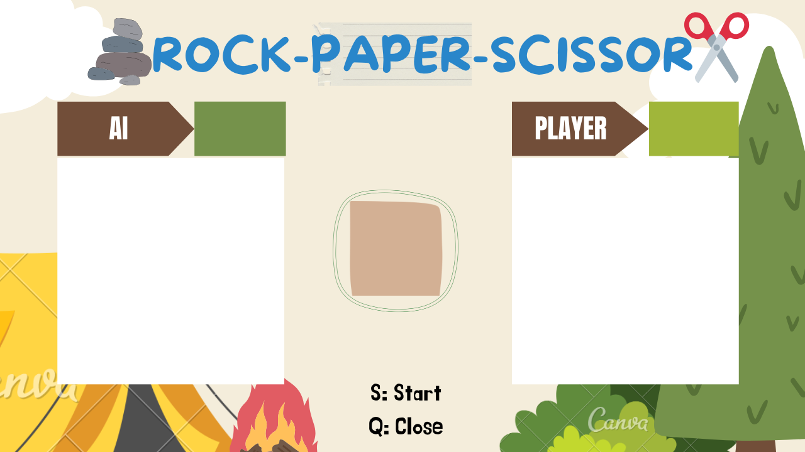

# Rock Paper Scissors - AI Smart Game

## 📌 Project Description

This is an interactive **Rock Paper Scissors** game where the player competes against an AI opponent. Unlike traditional random AI selection, this game employs a **smart AI** that predicts the player's moves based on past choices and selects the best counter-move to win.

The game uses **hand gesture recognition** via the webcam, allowing players to play using real-time hand signals. The AI opponent dynamically adjusts its strategy, making the game more challenging and engaging.

## 🛠 Features

- 🎮 Hand Gesture Recognition: Play using your real-world hand gestures.

- 🤖 AI Strategy: The AI predicts the player's next move using past choices.

- 🎨 Real-Time Graphics: A visually appealing UI with smooth overlays.

- 🏆 Scoring System: First to 10 points wins, with a fun popup announcement.

- 🔄 Auto Restart: Once a player reaches 10 points, the game resets automatically.

## 🎨 UI Preview

The game features an intuitive and visually appealing interface. Below is a screenshot of the game UI:


## 🚀 Installation

To run this project, install the required dependencies:
```
pip install -r requirements.txt
```
Ensure you have a webcam enabled and functioning.

## 🎯 How to Play

1. Run the game using:
```
python Game.py
```
2. Use the following hand gestures:

  - ✊ Rock → Close your fist

  - ✋ Paper → Open all fingers

  - ✌ Scissors → Show two fingers (index & middle)

3. Press 's' to start the game.

4. The AI will predict and counter your moves to make the game more competitive.

5. The first to 10 points wins, and the game restarts automatically.

6. Press 'q' anytime to quit.

## 🔧 Dependencies

This project requires:

- OpenCV

- cvzone

- HandDetector (from cvzone)

Make sure all dependencies are installed from `requirements.txt` before running.

## 🎉 Enjoy the Game!

Challenge yourself and see if you can outsmart the AI! Have fun playing. 🚀
